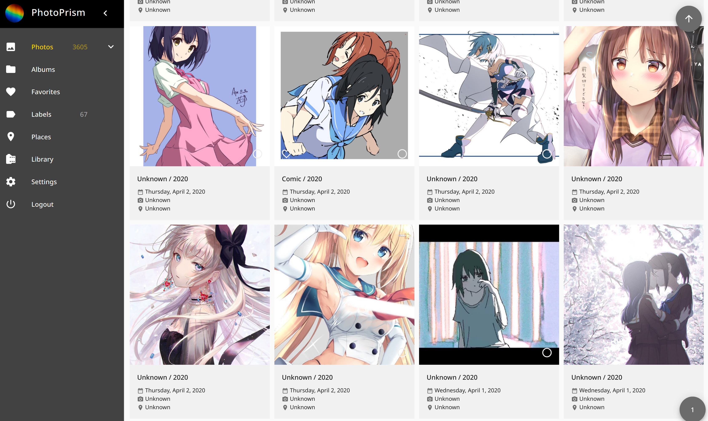

# Twitter Favorites(Likes) Archive
A series of scripts to archive your metadata and medias of Twitter Favorites(Likes).

## Prerequisites
### Twitter API
Register an App on [Twitter Developer](https://developer.twitter.com/apps) and get
access credentials in the "Keys and Tokens" tab of your App's page.

### Dependencies(for running locally)
- ruby 2.6
- [jq](https://github.com/stedolan/jq)
- wget
- GNU parallel
- [fd](https://github.com/sharkdp/fd)
- [exiftool](https://github.com/exiftool/exiftool)

## Usage
### Run in Docker
#### Setup
Rename `docker/config-example.env` to `docker/config.env` and customize it with:
- Twitter API credentials
- Your username
- [optional] Cron job schedule(for "Cron job" section)
- Other docker ENV variables.

#### Oneshot
```sh
docker run --rm --name=tfa --env-file=./docker/config.env -v ${PWD}/output:/app/output 15cm/twitter-favorites-archive /app/scripts/archive.sh /app/output
```

#### Cron job
Rename `docker/docker-compose-example.yaml` to `docker/docker-compose.yaml` and
customize it with the mount point of `app-output` volume.

`cd` into `docker` folder and run:
```
docker-compose up -d
```
### Run in local environment
#### Setup
Run `gem install bundler && bundle install` to install Ruby dependencies.

Rename `config-example.yaml` to `config.yaml` and customize it with:
- Twitter API credentials
- Your username

You can also run `./twitter-favorites-archive.rb init [args...]` to generate
`config.yaml`.

#### Execute
1. Run `./twitter-favorites-archive.rb meta`. It will dumps meta data of
your favorite tweets under `output/year/month/tweet_id/tweet.json`.
2. [Optional] Run `./scripts/00-download-all-medias.sh output`. It will download all media(jpeg of photos and video thumbnail) files of `tweet.json` to the same folder.
3. [Optional] Run `./scripts/01-update-all-medias-meta.sh output`. It will fetch meta data from `tweet.json` and populate Exif data of the downloaded media files.

To run all the steps together with data dumped to `output/`, run `./scripts/archive.sh output`

## Use cases
### PhotoPrism
I import the media files gathered by this project into [PhotoPrism](https://github.com/photoprism/photoprism) so that I can browse images of my Twitter Favorites in a more flexible way.


